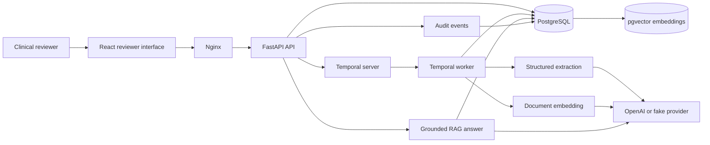
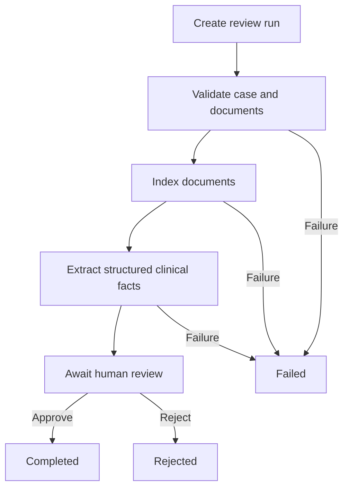

# CaseLens

[](https://github.com/OussamaKINANI/CaseLens/actions/workflows/ci.yml)

**Evidence-grounded clinical case review with durable human oversight.**

CaseLens is a full-stack clinical AI engineering demonstration built around a simple safety principle: AI output must remain traceable to source evidence and must never replace the human reviewer.

The application accepts synthetic clinical documents, extracts structured facts with exact citations, indexes evidence using vector embeddings, answers case-scoped questions with deterministic abstention, and orchestrates durable human review through Temporal.

> [!IMPORTANT]
> CaseLens is an educational portfolio project that uses synthetic data only. It is not a medical device, is not clinically validated, and must not be used with real patient information or for diagnosis or treatment decisions.

## Highlights

- FastAPI API with strict Pydantic validation
- Signed-token reviewer authentication and role-based authorization
- PostgreSQL persistence and Alembic migrations
- `pgvector` case-scoped semantic retrieval
- Configurable fake and OpenAI providers
- Structured clinical extraction with exact evidence verification
- Grounded RAG answers with server-controlled relevance thresholds
- Deterministic refusal when evidence is insufficient
- Durable Temporal workflows and Activities
- Human approval or rejection through Temporal Updates
- Immutable audit events for case and workflow actions
- React and TypeScript reviewer interface
- One-command Docker Compose startup
- Backend, frontend, extraction, and retrieval evaluations
- GitHub Actions continuous integration

## Reviewer experience

CaseLens provides a reviewer worklist and evidence workspace containing:

- Case priority and review status
- Uploaded source documents
- AI-extracted clinical facts
- Exact supporting quotations and character offsets
- Missing-information and ambiguity warnings
- Grounded case-question answering
- Durable workflow state
- Human approval and rejection controls
- Complete case audit history

## Architecture



## Durable review workflow



Document indexing and extraction Activities are idempotent. Temporal can retry transient failures without duplicating stored results. The workflow pauses durably at the human-review checkpoint and resumes only after an accepted reviewer Update.

## Safety design

### Evidence verification

Every extracted fact and generated answer citation is checked against the original source text:

- Document ID must match an allowed source document.
- Character offsets must remain inside the document.
- The quoted text must exactly match the source substring.
- Unsupported citations cause the provider response to be rejected.

### Case isolation

Retrieval joins document chunks to their owning case. Evidence from one case cannot be retrieved through another case ID.

### Server-controlled relevance

Clients cannot lower the retrieval threshold. `RAG_MIN_SIMILARITY` is configured by the server and returned in search and answer responses for transparency.

### Deterministic abstention

When no chunk satisfies the configured relevance threshold, CaseLens does not call the answer model. It returns:

```text
Insufficient evidence in the indexed case documents.
```

### Access control

Every endpoint that touches case data requires an authenticated
reviewer. Only the health probes and the sign-in route are public.

Access tokens are short-lived, signed with `JWT_SECRET_KEY`, and
carry the reviewer identity. Passwords are stored as salted
PBKDF2-HMAC-SHA256 hashes and never leave the database.

Reviewers hold one of two roles. Both can create cases, read
evidence, and approve or reject reviews; deleting a case, which
destroys its audit history, is reserved for `administrator`. The
stored role is authoritative, so a token issued before a role change
cannot outlive it.

### Human authority

CaseLens does not autonomously approve or reject clinical cases. Final decisions require an explicit human-review action and are written to the audit history.

### Prompt-injection boundary

Clinical documents are treated as untrusted data. Provider prompts explicitly prohibit following instructions found inside uploaded records.

## Technology stack

| Layer | Technology |
|---|---|
| Frontend | React, TypeScript, Vite |
| Frontend runtime | Nginx |
| API | FastAPI, Pydantic |
| Authentication | Signed JWT access tokens, PBKDF2 password hashing |
| Persistence | PostgreSQL, SQLAlchemy |
| Vector search | pgvector |
| Migrations | Alembic |
| Workflow orchestration | Temporal |
| AI extraction and answers | OpenAI or deterministic fake providers |
| Embeddings | OpenAI `text-embedding-3-small` or deterministic fake provider |
| Containers | Docker Compose |
| CI | GitHub Actions |
| Tests | pytest, frontend lint, TypeScript production build |

## Quick start with Docker

### Requirements

- Docker Desktop
- Docker Compose
- An OpenAI API key only if real AI providers are enabled

### 1. Clone the repository

```powershell
git clone https://github.com/OussamaKINANI/CaseLens.git
Set-Location .\CaseLens
```

### 2. Create the local environment file

```powershell
Copy-Item .\.env.example .\.env
```

The default example uses fake providers and does not require an API key.

It also defines the bootstrap reviewer account and a placeholder
token-signing key:

```dotenv
JWT_SECRET_KEY=change-me-to-a-long-random-signing-key
SEED_REVIEWER_EMAIL=reviewer@caselens.local
SEED_REVIEWER_PASSWORD=change-me-reviewer
```

Change the password and generate your own signing key before running
CaseLens anywhere other than your own machine:

```powershell
python -c "import secrets; print(secrets.token_urlsafe(48))"
```

For real OpenAI extraction, answers, and embeddings, edit `.env` locally:

```dotenv
AI_PROVIDER=openai
EMBEDDING_PROVIDER=openai
OPENAI_API_KEY=your-key-here
```

Never commit `.env` or an API key.

### 3. Start the complete stack

```powershell
docker compose up --build --detach
```

### 4. Confirm service health

```powershell
docker compose ps --all
```

The migration service should show `Exited (0)`. The database, Temporal server, API, worker, and frontend should be running and healthy.

### 5. Open CaseLens

| Service | URL |
|---|---|
| CaseLens interface | http://127.0.0.1:3000 |
| FastAPI documentation | http://127.0.0.1:8000/docs |
| Temporal UI | http://127.0.0.1:8233 |
| API readiness | http://127.0.0.1:3000/ready |

### 6. Stop the stack

```powershell
docker compose down
```

Named PostgreSQL and Temporal volumes are preserved by this command.

## Demonstration flow

1. Open `http://127.0.0.1:3000` and sign in with the seeded reviewer account.
2. Select **New case**.
3. Enter a synthetic patient reference.
4. Select a requested service and priority.
5. Upload `demo_data/synthetic-lumbar-note.txt`.
6. Open the new reviewer workspace.
7. Select **Start durable review**.
8. Watch Temporal progress through indexing and extraction.
9. Inspect structured facts and exact evidence quotations.
10. Ask:

```text
What treatment was attempted for the patient's lower back pain?
```

11. Confirm the answer includes an exact source citation.
12. Ask:

```text
What kidney medication was prescribed?
```

13. Confirm CaseLens refuses because no relevant evidence meets the threshold.
14. Review the audit trail.
15. Enter reviewer notes and approve or reject the review.

## Local development

### Backend

```powershell
python -m venv .venv
.\.venv\Scripts\Activate.ps1

python -m pip install `
    -r .\backend\requirements.txt

Set-Location .\backend
python -m alembic upgrade head
python -m app.seed_reviewers

python -m uvicorn `
    app.main:app `
    --reload
```

### Temporal worker

In a separate terminal:

```powershell
Set-Location .\backend
python -m app.temporal_worker
```

### Frontend

In a separate terminal:

```powershell
Set-Location .\frontend
npm install
npm run dev
```

The development frontend is available at `http://localhost:5173`.

## Testing

### Backend

The backend suite includes schema validation, API behavior, authentication and authorization, database persistence, audit events, evidence verification, extraction, RAG indexing and retrieval, relevance thresholds, workflow records, Activities, gateway behavior, and Worker model registration.

```powershell
python -m pytest .\backend\tests -q
```

Current local suite:

```text
161 passed
```

### Frontend

```powershell
Set-Location .\frontend

npm run lint
npm run build
```

### CI

Every push and pull request runs:

- Backend tests against PostgreSQL with pgvector
- Main and test database migrations
- Frontend lint
- Frontend TypeScript production build

## Evaluations

Evaluation records use small synthetic datasets and are engineering regression checks, not clinical-validation claims.

### Extraction

```powershell
python .\evals\run_extraction_evals.py `
    --provider fake

python .\evals\run_extraction_evals.py `
    --provider openai `
    --show-outputs
```

Metrics include:

- Precision
- Recall
- F1
- Assertion-classification accuracy
- Unsupported-fact rate
- Citation validity

### Retrieval

```powershell
python .\evals\run_retrieval_evals.py `
    --provider fake `
    --top-k 3

python .\evals\run_retrieval_evals.py `
    --provider openai `
    --top-k 3
```

The OpenAI embedding evaluation snapshot produced:

| Metric | Result |
|---|---:|
| Hit@1 | 1.000 |
| Hit@3 | 1.000 |
| Mean reciprocal rank | 1.000 |

The retrieval dataset currently contains 14 synthetic queries across answerable and unanswerable cases.

## API surface

Key endpoints include:

```text
GET  /health
GET  /ready

POST /v1/auth/login
GET  /v1/auth/me

POST   /v1/cases
GET    /v1/cases
GET    /v1/cases/{case_id}
DELETE /v1/cases/{case_id}

POST /v1/cases/{case_id}/documents
GET  /v1/cases/{case_id}/documents

POST /v1/cases/{case_id}/documents/{document_id}/index
POST /v1/cases/{case_id}/documents/{document_id}/extractions
GET  /v1/cases/{case_id}/extractions

POST /v1/cases/{case_id}/search
POST /v1/cases/{case_id}/answer

GET  /v1/cases/{case_id}/audit

POST /v1/cases/{case_id}/review-runs
GET  /v1/cases/{case_id}/review-runs
POST /v1/cases/{case_id}/review-runs/{review_run_id}/start
POST /v1/cases/{case_id}/review-runs/{review_run_id}/human-review
```

Interactive schemas are available through `/docs`.

## Repository structure

```text
CaseLens/
├── .github/workflows/       Continuous integration
├── backend/
│   ├── app/                 API, models, AI services, and workflows
│   ├── migrations/          Alembic database migrations
│   ├── tests/               Backend regression suite
│   └── Dockerfile
├── demo_data/               Synthetic demonstration records
├── evals/
│   ├── datasets/            Synthetic evaluation datasets
│   └── run_*_evals.py       Evaluation runners
├── frontend/
│   ├── src/                 React reviewer interface
│   ├── Dockerfile
│   └── nginx.conf
├── compose.yaml
└── README.md
```

## Engineering lessons demonstrated

- Requirements should be validated before building AI behavior.
- Clinical AI output needs traceable evidence, not just fluent text.
- Retrieval must be scoped at the database-query level.
- Relevance thresholds belong to the server, not the client.
- Workflow retries require idempotent Activities.
- Standalone workers must load the complete SQLAlchemy model registry.
- Human review should be a durable state transition, not an in-memory flag.
- Real provider quality must be measured using repeatable evaluation datasets.
- Production failures should become regression tests.

## Current limitations

CaseLens is intentionally a portfolio demonstration. It currently does not provide:

- Reviewer self-service account management, password reset, or MFA
- Production secret management
- Encryption-key management
- Multi-tenant isolation
- Clinical validation
- HIPAA-compliant deployment controls
- Real EHR connectivity
- Production monitoring or alerting

These would be required before any real clinical use.

## License

No license has been assigned yet. All rights are reserved by the repository owner.